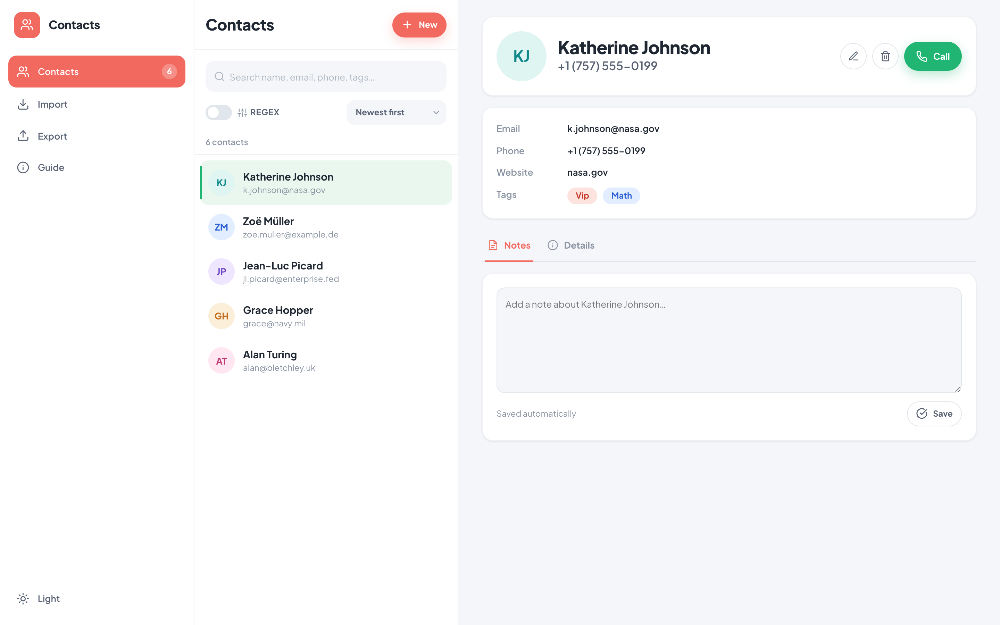
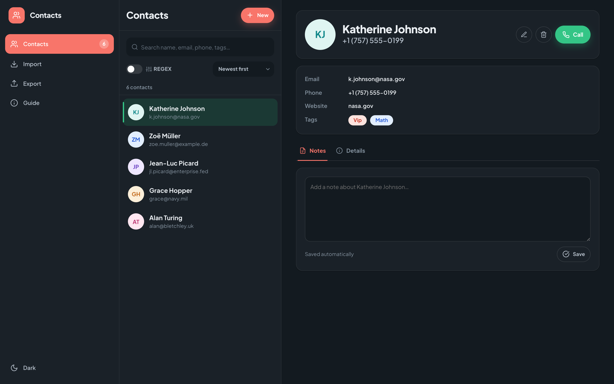
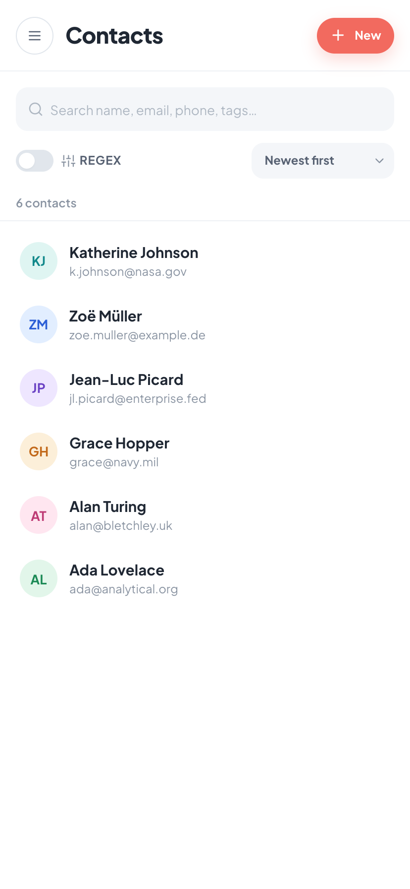
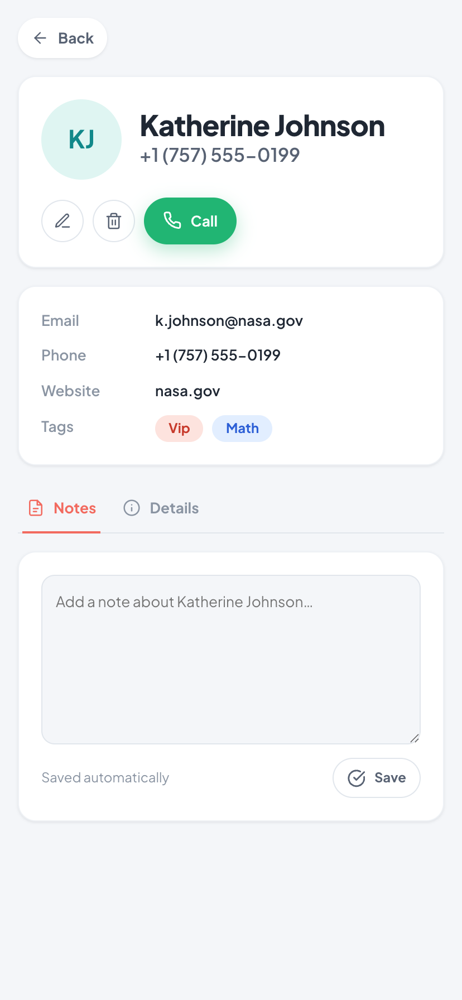

# Contacts

> Summative project for the Responsive Design module (Building Responsive UI).

A small contact manager I built with plain HTML, CSS and JavaScript. No
framework, no build step. It saves your contacts in the browser, lets you import
and export them as JSON, validates the form with regular expressions, and has a
search box that can run real regex patterns safely.

**Live demo:** https://rukundo-joe.github.io/responsive-contacts-manager/

<p align="center">
  
</p>

## Layout

It's a three-pane CRM, modelled on modern call-CRM dashboards (the layout was
inspired by a Call Sumo dashboard concept): a **sidebar** for navigation, a
**contacts list** in the middle, and a **detail panel** on the right.

The whole thing is responsive around that idea:

- **Desktop** shows all three panes at once, filling the window edge to edge,
  each pane scrolling on its own.
- **Medium screens** collapse the sidebar to a slim icon rail to keep the list
  and detail roomy.
- **Mobile** shows one pane at a time: the list fills the screen, tapping a
  contact slides the detail in with a back button, and the sidebar becomes a
  drawer behind a hamburger.

The detail panel has the contact's photo-style avatar, name, phone and a green
**Call** action, the email / phone / website / tags, and **Notes / Details**
tabs. Notes are a free-text field saved per contact.

<p align="center">
  
</p>

## What it does

- Browse contacts in a list and open anyone to see their full details.
- Add, edit and delete contacts in an accessible modal.
- Per-contact **notes**, saved as you go.
- Validates each field as you type, with inline error messages.
- Search by name, email, phone or tag. Flip on **Regex** to match patterns.
- Highlights the matching text in the results.
- Sort by name, date added, or last updated.
- Saves to `localStorage`, so your contacts are still there after a reload.
- Export everything to a JSON file and import it back later (merge or replace).
- Light and dark themes (it follows your system setting and remembers a toggle).
- A short welcome guide on first load, reachable again from the sidebar.
- Works from a narrow phone up to a wide desktop.
- Fully keyboard operable, with shortcuts.

### On mobile

One pane at a time: the list fills the screen, and tapping a contact slides in
the detail with a back button.

<p align="center">
  
  &nbsp;&nbsp;
  
</p>

## Running it

There's nothing to install. Because it uses ES modules it has to be served over
HTTP (opening the file directly with `file://` won't work).

```bash
git clone https://github.com/rukundo-joe/responsive-contacts-manager.git
cd responsive-contacts-manager

python3 -m http.server 8080
# or: npx serve .
# or: npm start

# then open http://localhost:8080
```

To try it with some data, hit **Import** and pick `assets/sample-contacts.json`.

## How the code is laid out

I split the JavaScript so each file does one job:

```
scripts/
  storage.js      reads/writes localStorage, handles JSON import/export
  validation.js   the regex rules and the field validators
  search.js       builds the search regex safely, filters, highlights matches
  state.js        the store: holds the data, sorts it, saves on every change
  ui.js           builds the DOM (cards, empty states, toasts)
  app.js          wires it all together: events, dialogs, theme, shortcuts
styles/style.css  the design system and responsive layout
tests/            the test suite (runs in Node and in the browser)
assets/           favicon, sample data, screenshots
```

The store is the only thing that owns the contacts array. The UI reads from it
and never edits it directly, which keeps the data flow easy to follow.

## Regex rules

All of these are in `scripts/validation.js`.

| Field | What it checks | Notes |
|-------|----------------|-------|
| Name | Letters (including accents) joined by space, hyphen or apostrophe | |
| Email | A valid address, with length limits | Uses two lookaheads to cap the whole address at 254 chars and the local part at 64 |
| Phone | International number, optional `+`, separators and parentheses | |
| Website | Optional `http(s)://` and `www.`, a host with a TLD, optional path | |
| Tags | Comma-separated words | |
| Duplicate tag | The same tag appearing twice in the list | Uses a back-reference (`\1`) |

So that's four ordinary rules plus two "advanced" ones: the email lookaheads and
the duplicate-tag back-reference.

For search, plain mode escapes whatever you type so a `.` or `(` is treated
literally. Regex mode caps the length, rejects the patterns that cause runaway
backtracking like `(a+)+` or `(.*)*`, and wraps the compile in a `try/catch` so a
broken pattern shows a friendly message instead of throwing.

## Keyboard

| Key | Does |
|-----|------|
| `Tab` / `Shift`+`Tab` | Move between controls |
| `/` | Jump to the search box |
| `n` | Open the Add contact dialog |
| `Esc` | Close a dialog, or clear the search box when it's focused |
| `Enter` | Submit the form / activate a button |

The dialogs use the native `<dialog>` element, so focus is trapped while one is
open and goes back to where it was when it closes.

## Accessibility

- Proper landmarks (`header`, `nav`, `main`, `footer`), one `h1`, headings in
  order, and a skip link to the list.
- Every input has a label. Errors are tied to their input with
  `aria-describedby`, marked with `aria-invalid`, and announced via
  `role="alert"`.
- A visually hidden live region announces things like "Added Ada" and the number
  of search results.
- Decorative icons are hidden from screen readers; icon-only buttons have labels.
- Colours meet WCAG AA contrast in both themes, with a stronger-border fallback
  for `prefers-contrast: more`.
- Animations are switched off for `prefers-reduced-motion`.

## Tests

The same set of tests runs two ways.

```bash
node tests/test.js      # or: npm test
```

For the browser version (it also checks a real localStorage save/reload), serve
the project and open `http://localhost:8080/tests/tests.html`.

They cover the validators (including the email length limit and the duplicate-tag
rule), the search compiler (escaping, bad patterns, the backtracking guard, the
length cap), the match highlighting (including that it can't be used for XSS),
and the JSON import/export including malformed input.

I also test by hand: add an invalid contact and watch the errors, fix it and
reload to confirm it persists, edit and delete, export then re-import, throw some
broken JSON at the importer, try a regex search, switch themes, and run through
the whole thing on a phone-sized screen with only the keyboard.

## Deployment

It's a static site, deployed on **GitHub Pages** from the `main` branch:
https://rukundo-joe.github.io/responsive-contacts-manager/

## Demo

A ~2.5 min screen recording walking through navigation, the add form with live
validation, regex search and its edge cases, notes, edit/delete, JSON
import/export, persistence across reload, keyboard use, and the responsive
breakpoints in light and dark.

- In the repo: [`demo/demo.mp4`](demo/demo.mp4)
- Direct link: https://rukundo-joe.github.io/responsive-contacts-manager/demo/demo.mp4

## License

MIT.
